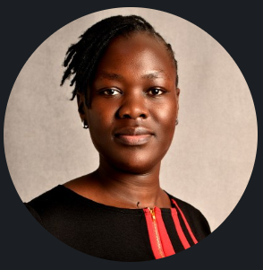

# 📇 Digital Business Card

<!-- FORCE EDGE-TO-EDGE MOBILE VIEWPORT STANDARDIZATION ENGINE -->

<!-- MAIN MOBILE BUSINESS CARD PANEL LAYER -->

  
  <!-- CROWN HEADER BANNER: OFFICIAL CONSULTING TITLES ROW -->
  

    <h1 style="color: #FFFFFF !important; margin: 0 0 4px 0 !important; font-size: 22px !important; font-weight: 900 !important; letter-spacing: 0.5px !important; font-family: 'Arial', sans-serif !important; text-transform: uppercase !important;">Edna Ogutu</h1>
    
Data Analyst & Web Designer

  

  <!-- CORE VALUE HOOK CONTENT CARD PANEL -->
  

    
    <!-- CENTERED CIRCULAR PROFILE PICTURE CONTAINER WITH REAL AVATAR -->
    

      
    

    
    <!-- RE-ENGINEERED 4-PILLAR BRAND COMPETENCY GRID -->
    

      

        📊 Data Analytics
      

      

        🧼 CRM Audits
      

      

        🔬 Field Research
      

      

        🌐 Web Design
      

    

    <!-- HIGH-CONTRAST DYNAMIC QR CODE DISPLAY NODE -->
    

      <a href="https://github.io" target="_blank" style="text-decoration: none !important; display: block !important;">
        
        📷 Scan to Explore Website
      </a>
    

    <!-- DIRECT ACTION ONE-TAP CHANNELS BUTTON DECK LAYOUT -->
    

      
      <!-- ROUTE 1: PORTFOLIO GATEWAY HUB -->
      <a href="https://github.io" target="_blank" style="background-color: #1A488E !important; color: #FFFFFF !important; text-decoration: none !important; padding: 11px 15px !important; border-radius: 6px !important; font-weight: 800 !important; font-size: 12.5px !important; text-transform: uppercase !important; letter-spacing: 0.5px !important; display: block !important; font-family: 'Arial', sans-serif !important;">
        🌐 View Full Portfolio Hub
      </a>

      <!-- ROUTE 2: WHATSAPP MESSENGER ROUTER -->
      <a href="https://wa.me" target="_blank" style="background-color: #25D366 !important; color: #FFFFFF !important; text-decoration: none !important; padding: 11px 15px !important; border-radius: 6px !important; font-weight: 800 !important; font-size: 12.5px !important; text-transform: uppercase !important; letter-spacing: 0.5px !important; display: block !important; font-family: 'Arial', sans-serif !important;">
        💬 Launch WhatsApp Chat
      </a>

      <!-- ROUTE 3: INSTANT EMAIL TRIGGER CLIENT -->
      <a href="mailto:hednaogutuh@gmail.com" style="background-color: #4A5568 !important; color: #FFFFFF !important; text-decoration: none !important; padding: 11px 15px !important; border-radius: 6px !important; font-weight: 800 !important; font-size: 12.5px !important; text-transform: uppercase !important; letter-spacing: 0.5px !important; display: block !important; font-family: 'Arial', sans-serif !important;">
        📧 Send Email Inquiry
      </a>

    

  

  <!-- FIXED BASE IDENTITY BRAND SLAT ROW -->
  

    

      Nairobi, Kenya &nbsp;|&nbsp; +254 741 937074
    

  

